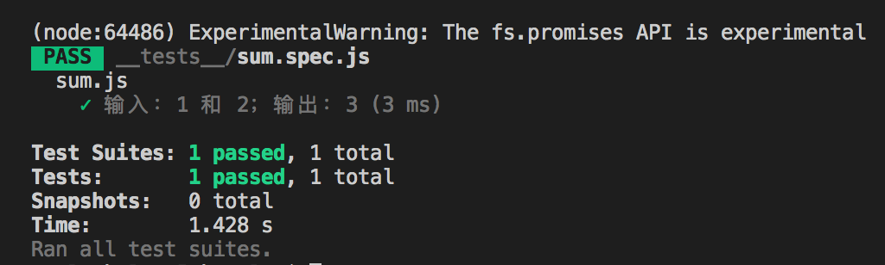

说起来也惭愧，从事开发工作到现在将近 5 年，在此之前没有写过任何一行单元测试代码。直到最近，公司在推动每个项目需要写单元测试用例，而且代码覆盖率有一定的指标，目的在于保证代码质量。于是，我成为了整个前端组第一个写单元测试用例，提前踩踩坑，积累经验。如今负责写单元测试用例的项目已完成，抽空把“人生第一次写单元测试用例”所遇到的各种问题整理成笔记，方便日后查阅。

项目使用的前端框架是 `Vue`，那么单元测试用例所选的框架也是围绕 `Vue` 生态来选择的。阅读 `Vue` 官网教程 [单元测试](https://cn.vuejs.org/v2/guidetesting.html#%E5%8D%95%E5%85%83%E6%B5%8B%E8%AF%95) 这一小节，最后采用 [Jest](https://jestjs.io/zh-Hans/) 和 [Vue Test Utils](https://vue-test-utils.vuejs.org/zh/)。接下来会从如何安装、如何写、怎么写三方面来介绍，带你们走一遍写单元测试用例整个流程。

# 一、安装

Jest 最新版本只支持 Babel 7，不支持 Babel 6，在 Jest 24 时已经移除对 Babel 6 的支持；所以项目中使用的是 Babel 6 的话，需要安装 Jest 版本 24 以下的，否则项目是运行不起来。那么接下来会介绍 Babel 6 和 Babel 7 两种环境下如何安装 Jest。

## Babel 6 环境

### 1、安装 Jest

```javascript
npm install --save-dev jest@23.6.0
```

在 `package.json` 文件 `script` 标签里配置运行测试脚本，如下：

```javascript
"test:unit": "jest --no-cache"
```

根据 [《Test Vue.js Applications》](https://www.manning.com/books/testing-vue-js-applications) 这本书的建议，如果使用的是 Windows，需要在 jest 命令后参数 `--no-cache`，避免发生潜在的错误。

此时在控制台执行命令：`npm run test:unit`，会看到控制台有报错信息：

```javascript
testMatch: **/__tests__/**/*.[jt]s?(x), **/?(*.)+(spec|test).[tj]s?(x) - 0 matches
testPathIgnorePatterns: /node_modules/ - 173 matches
testRegex:  - 0 matches
Pattern:  - 0 matches
```

意思是没有找到任何匹配的测试文件。这是因为 Jest 框架会在整个项目中全局匹配测试文件，然后运行相应的测试用例。\_\_tests__ 是 Jest 默认匹配的文件夹，文件夹里的测试文件是以 `.spec.js` 或者 `.test.js` 为后缀的。因此，我们需要在项目**根目录**创建文件夹 \_\_tests__，同时创建以 `.spec.js` 为后缀的文件。

举个例子：

```javascript
// sum.js
export const sum = (s1, s2) => {
	return s1 + s2
}
```

单元测试用例如下：

```javascript
// __tests__/sum.spec.js
import {sum} from '../sum.js'

describe('sum.js', () => {
    test('输入：1 和 2；输出：3', () => {
        expect(sum(1, 2)).toBe(3)
    })
})
```

输出结果：



从输出结果可知，单元测试用例已经能正常跑起来。

如果想要让测试文件一旦有改动，就自动运行测试用例，那么可以在执行命令时添加参数 `--watch`，即 `npm run test:unit -- --watch`。为了不用每次执行命令时输入参数 `watch`，可以直接在 `package.json` 文件进行配置：

```javascript
{
	"test:unit": "jest --no-cache",
	"test": "npm run test:unit -- --watch"
}
```

直接执行命令 `npm run test` 就可以了。

### 2、安装 Vue Test Units

Jest 要测试 Vue 单文件组件，需要安装框架 Vue Test Unit，具体安装教程如下：

```javascript
npm install --save-dev jest @vue/test-utils
```

### 3、安装 vue-jest 预处理器

为了让 Jest 知道如何处理 `*.vue` 文件，需要安装和配置 `vue-jest` 预处理器

```javascript
npm install --save-dev vue-jest
```

### 4、配置 Jest 

Jest 可以单独创建配置文件，也可以在 `package.json` 文件添加 `jest` 块进行配置，这里采用的是在 `package.json` 文件进行配置，具体如下：

```javascript
// package.json

{
	"jest": {
        "moduleFileExtensions": [
            "js",
            "json",
            // 告诉 Jest 处理 `*.vue` 文件
            "vue"
        ],
        "transform": {
            // 用 `vue-jest` 处理 `*.vue` 文件
            ".*\\.(vue)$": "vue-jest"
        },
        // 处理 webpack 别名
        "moduleNameMapper": {
            "^@/(.*)$": "<rootDir>/src/$1",
            // 作用：引入 element-ui，处理 CSS 模块，需要安装 identity-obj-proxy 依赖
            "\\.(css|less)$": "identity-obj-proxy"
        }
    }
}
```

### 5、为 Jest 配置 Babel

```javascript
npm install --save-dev babel-jest@23.6.0
```

然后在 `package.json` 文件 `jest. transform` 添加一个入口，来告诉 Jest 使用 `babel-jest` 处理 JavaScript 测试文件

```javascript
{
	"jest": {
        "transform": {
              // 用 `babel-jest` 处理 js
     		"^.+\\.js$": "<rootDir>/node_modules/babel-jest"
        }
    }
}
```

### 6、测试覆盖率

Jest 可以配置输出测试覆盖率报告，简单的配置如下：

```javascript
{
	"jest": {
		// 开启收集覆盖率
		"collectCoverage": true,
		// 指定测试覆盖率报告输出路径
        "coverageDirectory": "<rootDir>/tests/unit/coverage",
        // 指定测试覆盖率以什么样的方式展示
        "coverageReporters": [
            "html",
            "text-summary"
        ],
        // 指定哪些文件可以被收集；哪些文件不需要被收集
        "collectCoverageFrom": [
        ]
    }
}
```

至于更详细的配置，可参考 [Jest 配置](https://jestjs.io/docs/zh-Hans/configuration#collectcoverage-boolean)

### 7、Jest 测试单文件例子

先给出 `package.json` 文件对 Jest 的配置：

```javascript
{
	"jest": {
        "moduleFileExtensions": [
            "js",
            "json",
            "vue"
        ],
        "transform": {
            ".*\\.(vue)$": "vue-jest",
            "^.+\\.js$": "<rootDir>/node_modules/babel-jest"
        },
        "moduleNameMapper": {
            "^@/(.*)$": "<rootDir>/src/$1",
            // 作用：引入 element-ui，处理 CSS 模块，需要安装 identity-obj-proxy 依赖（npm install --save-dev identity-obj-proxy）
            "\\.(css|less)$": "identity-obj-proxy"
        },
        "collectCoverage": true,
        "coverageDirectory": "<rootDir>/tests/unit/coverage",
        "coverageReporters": [
            "html",
            "text-summary"
        ],
        "collectCoverageFrom": [
        ]
    }
}
```

Test.vue 文件：

```javascript
<template>
    <div>Test.vue</div>
</template>

<script>
export default {
    
}
</script>
```

Test.spec.js 测试文件

```javascript
import Test from '../Test.vue'
import { mount } from '@vue/test-utils'

console.log(Test)
describe('Test.vue', () => {
    test('正常渲染 Test.vue 组件', () => {
        const wrapper = mount(Test)
        expect(wrapper.find('div').text()).toContain('Test.vue')
    })
})
```

Vue Test Units 提供两个方法来挂载 Vue 组件，分别是 `mount` 和 `shallowMount`。这两个方法的区别在于：`mount` 方法对整个文件进行解析，包括子组件；而 `shallowMount` 只会解析当前文件，对于当前文件所包含的子组件是不会解析的，可以根据具体的场景选用具体的方法，更详细的可参考官方文档 [Vue Test Utils](https://vue-test-utils.vuejs.org/zh/)。

## Babel 7 环境

这里需要列出与 Babel 6 环境的不同点，其余相同。

### 1、安装 Jest

```javascript
npm install --save-dev jest
```

### 2、为 Jest 配置 Babel

```javascript
npm install --save-dev babel-core@^7.0.0-bridge.0
npm install --save-dev babel-preset-env
npm isntall --save-dev babel-jest
```

# 二、确定范围

环境搭建好了，是不是就可以开始写测试用例了？且慢，还没到这一步，需要先确定怎么测，即哪些模块需要写测试用例。下面就列出认为需要测试的要点，至于到项目层可根据具体项目的实际情况而定。

- 抽离公共模块：公共函数、公共组件；

- 核心模块：覆盖各分支。

# 三、实战案例

这一部分主要来说下怎么写测试用例，具体内容是在项目中遇到过的，后续会继续补充。

### 1、公共函数测试用例

测试公共函数是比较简单的，毕竟相对比较独立，很好写测试用例。

date.js

```javascript
export const dateFormat = (timestamp) => {
    const date = new Date(timestamp * 1000)
    const year = date.getFullYear()
    let month = date.getMonth() + 1
    let d = date.getDate()

    month = month < 10 ? '0' + month : month,
    d = d < 10 ? '0' + d : d

    return year + '-' + month + '-' + d;
}
```

date.spec.js

```javascript
import {dateFormat} from '../date'

describe('dateFormat 方法', () => {
    test('输入：时间戳为 1611471600；输出：2021-01-24', () => {
        expect(dateFormat(1611471600)).toContain('2021-01-24')
    })
})
```

### 2、Vue 单文件组件

有些组件可能依赖一个全局插件，比如 `element-ui`、`vue-router`，为了做到独立性，避免影响到其它组件，可以使用 `createLocalVue` 来存档它们，并把它们放到一个配置文件，引入即可：`config.js`

```javascript
import { createLocalVue } from '@vue/test-utils'
import Vuex from 'vuex'
import VueRouter from 'vue-router'
import ElementUI from 'element-ui'

const localVue = createLocalVue()

localVue.use(Vuex)
localVue.use(ElementUI)

if (!process || process.env.NODE_ENV !== 'test') {
    localVue.use(VueRouter)
}

const router = new VueRouter()

export default {
    router,
    localVue
}
```

Test.vue

```javascript
<template>
    <div>
        <el-button type="primary" @click="click">模拟点击按钮</el-button>
    </div>
</template>

<script>
export default {
    name: 'Test',

    data () {
        return {
            count: 0
        }
    },
    methods: {
        click () {
            this.count++;
        }
    }
}
</script>
```

Test.spec.js

```javascript
import Test from '../Test.vue'
import config from '../config'
import { mount } from '@vue/test-utils'

const {localVue} = config

describe('Test.vue', () => {
    test('模拟点击按钮', () => {
        const wrapper = mount(Test, {
            localVue
        })
        wrapper.find('.el-button').trigger('click')
        expect(wrapper.vm.count).toBe(1)
    })
})
```

### 3、模拟 axios 发送请求

项目中难免会涉及到发送请求获取后端数据，而 Jest 测试时不可能真正发送请求去验证逻辑，那么我们可以模拟接口返回的数据，来测试我们的逻辑是否正常，具体例子如下：

Test.vue

```javascript
<template>
    <div>
        <el-button type="primary" @click="click">模拟 axios 发送请求</el-button>
    </div>
</template>

<script>
import axios from 'axios'
export default {
    name: 'Test',

    data () {
        return {
            list: []
        }
    },
    methods: {
        async click () {
            const result = await axios.get('/list')
            this.list = result.data
        }
    }
}
</script>
```

Test.spec.js

```javascript
import Test from '../Test.vue'
import config from '../config'
import { mount } from '@vue/test-utils'

jest.mock('axios', () => {
    return {
        get: jest.fn().mockImplementation(() => {
            return {
                data: [
                    {
                        id: 1,
                        name: 'username'
                    },
                    {
                        id: 2,
                        name: 'username'
                    }
                ]
            }
        })
    }
})
const {localVue} = config

describe('Test.vue', () => {
    test('模拟 axios 发送请求', async () => {
        const wrapper = mount(Test, {
            localVue
        })
        await wrapper.find('.el-button').trigger('click')
        expect(wrapper.vm.list.length).toBe(2)
    })
})
```

### 测试 props

有时我们需要以 `props` 的方式从父组件传递数据给子组件，那么我们该如何测试数据是否真的传递到呢？Vue Test Units 框架支持测试 `props`，具体例子如下：

Test.vue

```javascript
<template>
    <div>
        <el-button type="primary" @click="click">点击</el-button>
    </div>
</template>

<script>
export default {
    name: 'Test',

    props: {
        count: {
            type: Number,
            default: 0
        }
    },

    data () {
        return {
            result: 0
        }
    },

    mounted() {
        
    },

    methods: {
        click () {
            console.log('Click: ', this.count)
            this.result = this.count * 2
        }
    }
}
</script>
```

Test.spec.js

```javascript
import Test from '../Test.vue'
import config from '../config'
import { mount } from '@vue/test-utils'

const {localVue} = config

describe('Test.vue', () => {

    test('模拟点击按钮', async () => {
        const wrapper = mount(Test, {
            localVue,
            propsData: {
                count: 1
            }
        })

        console.log(wrapper.props().count)

        await wrapper.find('.el-button').trigger('click')

        expect(wrapper.vm.result).toBe(2)
    })
})
```

### 5、模拟 window 属性

有时难免项目中会使用到 window 属性，而 Jest 框架不支持，也就是说没有实现 window 相关属性，所以执行到对应代码时会报错的。那么我们可以通过来模拟 window 属性，以此来避免该错误。这里给出模拟 `window.location.reload` 的例子，具体如下：

Test.spec.js

```javascript
describe('测试 window location 中 reload 方法', () => {
  const { reload } = window.location;

  beforeAll(() => {
    Object.defineProperty(window.location, 'reload', {
      configurable: true,
    });
    window.location.reload = jest.fn();
  });

  afterAll(() => {
    window.location.reload = reload;
  });
});
```

[Jest: Testing window.location.reload
](https://stackoverflow.com/questions/55712640/jest-testing-window-location-reload/55771671)


# 四、问题汇集

### 1、Babel 6 下安装 Jest 最新版本会报错

解决方案：

```javascript
npm install --save-dev jest@23.6.0
```

[Adding Jest to a Babel 6 project](http://blog.magmalabs.io/2019/06/27/adding-jest-to-a-babel-6-project.html)

### 2、babel-jest 版本比 jest 版本高报的错误

`TypeError: Cannot read property 'cwd' of undefined`

解决方案：版本与 jest 一样就好

### 3、`Handlebars` 版本问题，导致测试报告无法显示

```javascript
Handlebars: Access has been denied to resolve the property “from” because it
is not an “own property” of its parent
```

解决方案：

```javascript
npm i -D handlebars@4.5.0
```

[Handlebars 版本问题](https://stackoverflow.com/questions/59690923/handlebars-access-has-been-denied-to-resolve-the-property-from-because-it-is)

### 4、引入 element-ui css 解析报错

解决方案：

先安装依赖 `identity-obj-proxy`：

```javascript
npm install --save-dev identity-obj-proxy
```

然后在 `package.json` 文件 `jest.moduleNameMapper` 添加配置：

```javascript
{
	"jest": {
		"moduleNameMapper": {
			"\\.(css|less)$": "identity-obj-proxy"
    		}
	}
}
```

[引入 element-ui css 解析报错](https://hellogithub2014.github.io/2018/07/16/jest-quirks/)

# 五、参考资料

- [Vue Test Units](https://vue-test-utils.vuejs.org/zh/guides/#%E8%B5%B7%E6%AD%A5)

- [Jest](https://jestjs.io/docs/zh-Hans/getting-started.html)

- [Vue 测试指南](https://lmiller1990.github.io/vue-testing-handbook/zh-CN/)

- [Vue 应用测试](https://wangtunan.github.io/blog/test/vueTest.html#%E6%B5%8B%E8%AF%95%E4%BB%8B%E7%BB%8D)

由于水平有限，以上如有误，欢迎指出，一起交流。